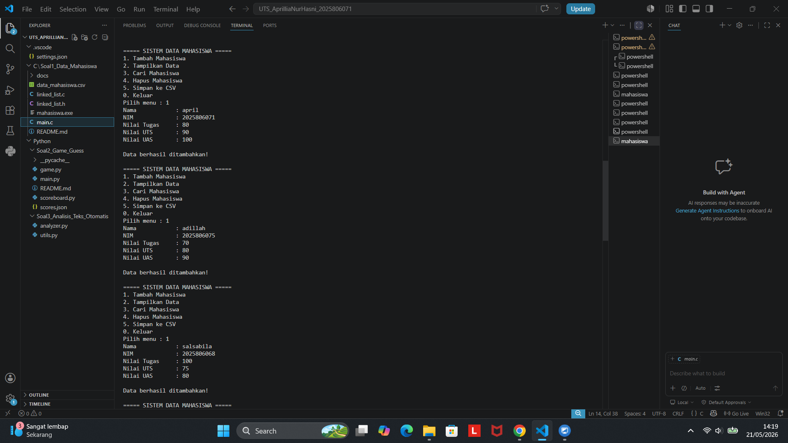
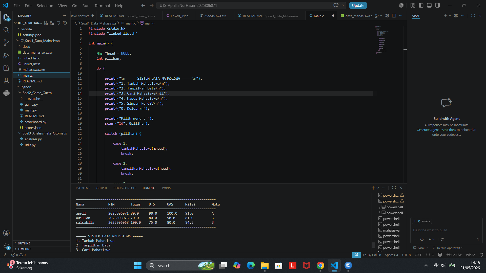
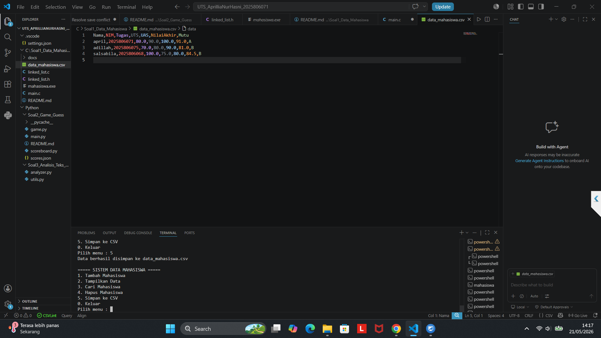

# UTS PEMROGRAMAN DASAR
## Sistem Data Mahasiswa Terintegrasi

### Nama
APRILLIA NUR HASNI

### NPM
2025806071

---

# Penjelasan Program

Program ini merupakan aplikasi pengelolaan data mahasiswa menggunakan struktur data linked list dengan bahasa C.  
Program dapat digunakan untuk:

- Menambah data mahasiswa
- Menampilkan data mahasiswa
- Mencari data mahasiswa
- Menghapus data mahasiswa
- Menyimpan data ke file CSV

---

# Struktur File

## 1. main.c
File utama program yang berisi menu dan alur program.

## 2. linked_list.h
Berisi deklarasi struct dan prototype fungsi.

## 3. linked_list.c
Berisi implementasi seluruh fungsi program.

## 4. data_mahasiswa.csv
File penyimpanan data mahasiswa dalam format CSV.

---

# Screenshot Program

## Screenshot Menu Program



---

## Screenshot Data Mahasiswa



---

## Screenshot File CSV



---

# Cara Menjalankan Program

## 1. Masuk ke Folder Project

```bash
cd soal1_data_mahasiswa
```

## 2. Compile Program

### Linux / MacOS

```bash
gcc main.c linked_list.c -o mahasiswa
```

### Windows (MinGW)

```bash
gcc main.c linked_list.c -o mahasiswa.exe
```

## 3. Jalankan Program

### Linux / MacOS

```bash
./mahasiswa
```

### Windows

```bash
mahasiswa.exe
```

---

# Contoh Tampilan Program

```text
========================================
 SISTEM DATA MAHASISWA TERINTEGRASI
========================================

1. Tambah Mahasiswa
2. Tampilkan Data
3. Cari Mahasiswa
4. Hapus Mahasiswa
5. Simpan CSV
0. Keluar

========================================
Pilih menu :
```
